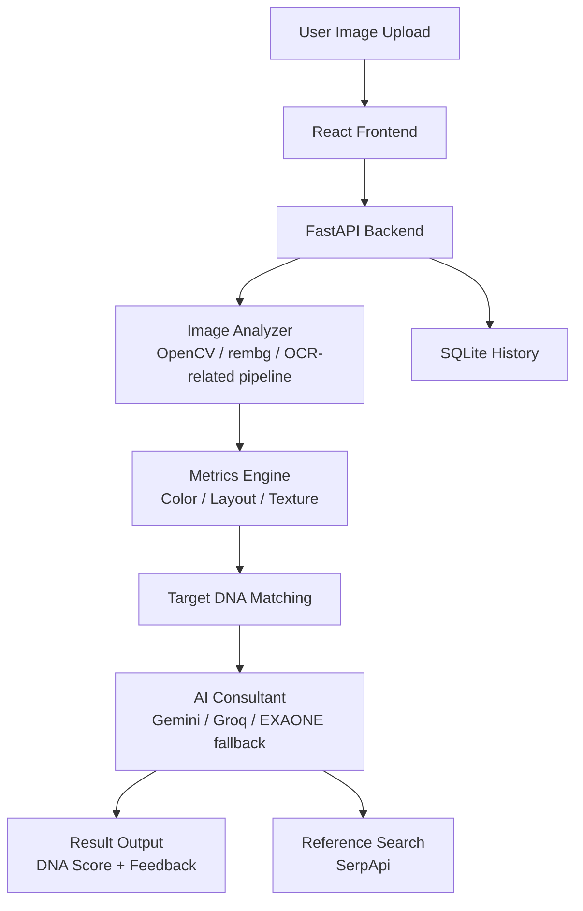

# Mood-DNA Ver 2.0


> Design Intelligence for Designers  
> 감각을 데이터로, 아이디어를 구조로.

> This repository is frozen as v2. New YIE/GraphRAG development continues in [Mood-DNA v3](https://github.com/hoilycat/Mood-DNA-V3).

## Introduction

Mood-DNA v2 is a FastAPI + React design-analysis tool. It analyzes uploaded images with computer-vision metrics, compares the result against target design DNA, and generates AI feedback with reference-image search.

This version includes the image metric engine, Gemini/Groq/EXAONE feedback flow, SerpApi reference search, SQLite history, single-image analysis, compare mode, and batch audition. Hybrid GraphRAG with Neo4j/LlamaIndex is not implemented in this v2 repository; that direction is continued in v3 through YIE.

## Core Features

### 1. Multi-Dimensional DNA Scanning

OpenCV, NumPy, EasyOCR-related dependencies, and rembg are used for visual analysis.

- Visual metrics: brightness, complexity, saliency, symmetry, whitespace, contrast, composition stability
- Form and texture: roundness, straightness, smoothness
- Color DNA: K-Means based palette extraction and color harmony scoring
- OCR/graphic separation support in the analyzer pipeline

### 2. AI Design Feedback

The backend generates design feedback through `backend/app/services/ai_consultant.py`.

- Primary model: Google Gemini
- Fallback options: Groq and local EXAONE/Ollama paths
- Feedback uses the measured metrics and target design context

### 3. Design Audition

Multiple design options can be compared against a target DNA profile.

- Single-image analysis
- A/B comparison
- Batch ranking
- Winner selection based on target similarity

### 4. Style Benchmarking

The backend can request reference images through SerpApi.

- Search logic: `backend/app/services/google_search.py`
- Result flow: analysis result + AI feedback + external reference candidates

## What Is Not In v2

These items appeared in the project direction, but are not implemented as working v2 code:

- Neo4j knowledge graph
- LlamaIndex GraphRAG pipeline
- Vector database retrieval
- `/rag/query` or `/rag/evidence` endpoint

For the implemented YIE/GraphRAG version, see [Mood-DNA v3](https://github.com/hoilycat/Mood-DNA-V3).

## Getting Started

### Prerequisites

| Tool | Version |
|------|---------|
| Node.js | 18+ |
| Python | 3.10+ |
| npm | 9+ |

### Install

```bash
git clone https://github.com/hoilycat/Mood-DNA-V2.git
cd Mood-DNA-V2

pip install -r backend/requirements.txt
cd frontend && npm install && cd ..
```

### Environment Variables

Create a `.env` file for the backend keys you use.

| Variable | Required | Description |
|----------|----------|-------------|
| `GEMINI_API_KEY` | Required | Gemini feedback engine |
| `SERP_API_KEY` | Required for references | Reference image search |
| `GROQ_API_KEY` | Optional | Fallback model |
| `UNSPLASH_ACCESS_KEY` | Optional | Additional image source |

### Run

Run the backend and frontend separately.

```bash
cd backend
uvicorn app.main:app --reload
```

```bash
cd frontend
npm run dev
```

Open `http://localhost:5173`.

## System Architecture



## Tech Stack

### Frontend

- React
- TypeScript
- Vite
- Tailwind CSS
- Shadcn UI
- Recharts

### Backend

- FastAPI
- OpenCV
- NumPy
- EasyOCR-related analysis dependencies
- rembg
- SQLAlchemy
- SQLite
- SerpApi integration

### AI Models

- Google Gemini
- Groq fallback
- EXAONE/Ollama local fallback path

## Project Structure

```text
Mood-DNA-V2/
├── frontend/             # React + Vite UI
│   └── src/
├── backend/              # FastAPI analysis backend
│   ├── app/
│   │   ├── main.py
│   │   ├── database.py
│   │   ├── models.py
│   │   └── services/
│   │       ├── analyzer.py
│   │       ├── ai_consultant.py
│   │       └── google_search.py
│   └── requirements.txt
└── README.md
```

## Roadmap

- [x] Image metric engine
- [x] Real-time design DNA visualization
- [x] Gemini/Groq/EXAONE feedback flow
- [x] Reference-image search
- [x] Batch audition
- [ ] Smart design history archiving
- [ ] GraphRAG/YIE integration, continued in v3

## Credits

Designed & Developed by 용용

