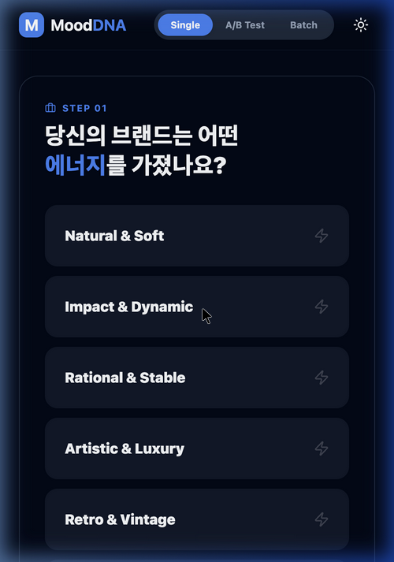
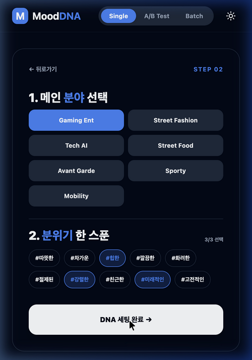
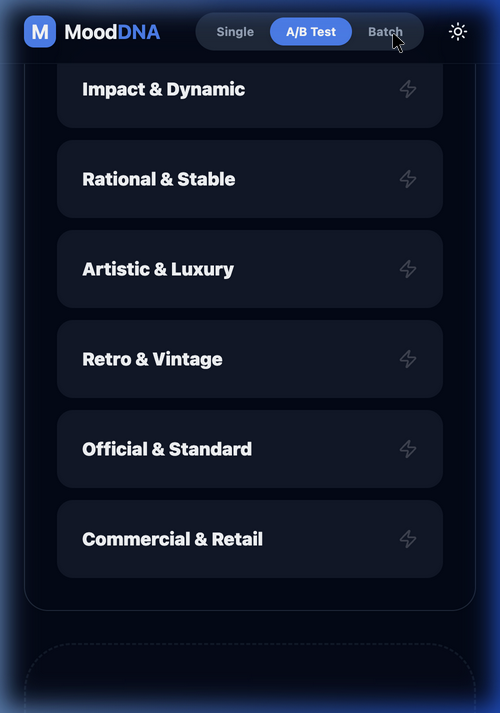
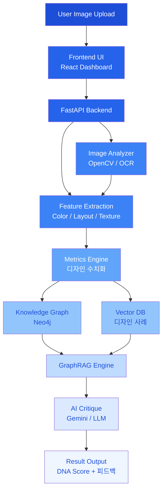

# 🌙 Mood-DNA Ver 2.0
 


 
> **"Design Intelligence for Designers"**
> 감각을 데이터로, 아이디어를 구조로.
> 디자인 이미지를 분석해 시각적 요소를 수치화하고, 지식 그래프 기반 AI로 디자인 결정을 논리적 근거와 함께 제시하는 **디자이너의 감각을 논리로 증명하는 AI 시스템**입니다.
 


<div align="center">
  
</div>

---
 
## 🖋️ Introduction
 
디자인 이미지를 분석해 시각적 요소를 수치화하고,
지식 그래프 기반 AI로 디자인 결정을 논리적 근거와 함께 제시하는 **AI 디자인 분석 도구**입니다.
 
단순한 이미지 분석을 넘어, 감각적 판단을 **수치 데이터와 디자인 이론**으로 번역해
디자이너의 설득력을 높여줍니다.
 
---
 
## ✨ Philosophy
 
> "디자인의 '감성'을 손상시키지 않으면서 AI의 '이성'을 더하다."
 
Mood-DNA는 기술이 디자인을 대체하는 것이 아니라, 디자이너가 자신의 직관을 논리적으로 증명하고 더 높은 차원의 창의성에 집중할 수 있도록 돕는 도구입니다.
 
---

## 📸 Screenshots

<div align="center">
  
  
  
</div>

---

## 🎯 Core Features

> ✅ 현재 구현 완료된 기능입니다.
 
### 🔍 1. Design Scanning Engine
OpenCV와 EasyOCR 기반의 이미지 시각 구조 분석 엔진입니다.
*   **Visual Metrics**
      밝기, 대비, 복잡도, Saliency, 대칭성, 여백 비율, 구도 안정성
*   **Form & Texture**
      곡률(Roundness), 직선성(Straightness), 매끄러움(Smoothness) 분석을 통한 형태적 특징 추출.
*   **Color DNA**
       K-Means 알고리즘 기반 주요 컬러 팔레트 및 색채 조화도 산출.


### 🏆 2. Design Decision Engine(Batch Analysis)
여러 디자인 시안을 비교하여 최적의 결과를 선택하는 의사결정 시스템입니다.
*   **DNA Matching**
      설정한 Target DNA와 실제 데이터 사이의 유사도를 계산하여 순위 산정.
*   **Master's Report**
      AI가 오디션 심사위원처럼 각 시안의 장단점을 비교 분석하여 마스터 리포트를 생성합니다.


### 🖼️ 3. Style Benchmarking
AI 피드백과 연동된 실무 레퍼런스 제안.
*   **SerpApi Integration**
      분석 결과와 매칭되는 최적의 디자인 레퍼런스를 Pinterest, Dribbble, Behance 등에서 실시간으로 수집.
*   **Context Matching**
      분석 결과와 유사한 디자인 스타일 큐레이션
---


## 🧠 In Development
 
> 현재 개발 중인 기능입니다. (논문 수집 및 지식 그래프 구축 진행 중)
 
### 🧠 Hybrid GraphRAG Critique 
 
기존에는 하드코딩된 수치 기준으로 디자인을 평가했다면,
이제는 **왜 그 수치인지**를 디자인 이론으로 설명해줍니다.
 
- **Knowledge Graph:** 디자인 원칙과 스타일 간의 관계망을 구축해 수치의 근거를 추적
- **Agentic AI:** DB에 없는 정보는 논문·웹 검색으로 실시간 보완
- **확장 가능한 구조:** 어떤 앱에서도 재사용 가능한 에이전트 설계

>#### 📌 Example Output (Simulated)
> **Input:** Brightness = 0.72, Contrast = 0.41
>
> **AI Analysis:**
> *    높은 밝기는 시각적 주목도를 증가시킴
> *    대비가 낮아 정보 계층 구조가 약화될 가능성 있음
> *    Gestalt 이론에 따르면 figure-ground separation이 약화될 수 있음
> **Reference:**
> *    Ware, C. (2013). Information Visualization: Perception for Design
> *    Tufte, E. (1990). Envisioning Information


---


## 🚀 Getting Started

### Prerequisites

| Tool | Version |
|------|---------|
| Node.js | 18+ |
| Python | 3.10+ |
| npm | 9+ |

### 1. Clone & Install

```bash
# 저장소 클론
git clone https://github.com/your-username/mood-dna-v2.git
cd mood-dna-v2

# Python 패키지 설치
pip install -r requirements.txt

# 프론트엔드 패키지 설치
cd frontend && npm install && cd ..
```

### 2. 환경변수 설정

```bash
cp .env.example .env
```

`.env` 파일을 열어 API 키를 입력하세요:

| 변수명 | 필수 여부 | 설명 | 발급처 |
|--------|-----------|------|--------|
| `GEMINI_API_KEY` | **필수** | Gemini AI 분석 엔진 | [Google AI Studio](https://aistudio.google.com/) |
| `SERP_API_KEY` | **필수** | 레퍼런스 이미지 검색 | [SerpApi](https://serpapi.com/) |
| `GROQ_API_KEY` | 선택 | AI 분석 폴백 모델 | [Groq](https://console.groq.com/) |
| `UNSPLASH_ACCESS_KEY` | 선택 | 추가 이미지 소스 | [Unsplash](https://unsplash.com/developers) |

> **참고:** `GROQ_API_KEY`가 없으면 Gemini 실패 시 로컬 Ollama(exaone3.5)로 폴백됩니다.

### 3. 실행

```bash
# 프론트엔드 + 백엔드 동시 실행 (루트에서)
npm run dev
```

또는 각각 따로 실행:

```bash
# 백엔드 (포트 8000)
cd backend && uvicorn app.main:app --reload

# 프론트엔드 (포트 5173)
cd frontend && npm run dev
```

브라우저에서 `http://localhost:5173` 접속

---


## 🎬 How It Works

Mood-DNA는 **4단계 위자드**로 디자인 DNA를 설정하고 이미지를 분석합니다.

```
Step 1 │ 업종 선택
       │ 7개 카테고리(Natural / Impact / Rational / Artistic / Retro / Official / Commercial)
       │ 각 카테고리 내 세부 업종(총 20+ 옵션)에서 브랜드와 가장 가까운 것을 선택
         ↓
Step 2 │ 분위기 태그 선택
       │ #따뜻한 #차가운 #힙한 #클래식한 등 10가지 감성 키워드 선택
       │ 업종 DNA(60%) + 분위기 태그(40%) 가중 블렌딩으로 Target DNA 생성
         ↓
Step 3 │ Target DNA 확인
       │ 레이더 차트로 목표 수치 시각화 및 미세 조정
         ↓
Step 4 │ 이미지 업로드 & 분석 모드 선택
       │ ├─ 단일 분석: 디자인 1장 → DNA 점수 + AI 크리티크
       │ ├─ 비교 분석: 디자인 2장 → 유사도 + 비교 리포트
       │ └─ 배치 오디션: 디자인 3장+ → 랭킹 + 마스터 리포트
```

---


## ⚙️ System Architecture
 

 
---


 
## 🧩 Tech Stack
 
### Frontend
*   **Framework:** React 19.2, TypeScript, Vite
*   **Styling:** Tailwind CSS 4.2, Shadcn UI
*   **Data Viz:** Recharts 3.7 (Radar Chart 기반 DNA 시각화)
*   **Animation:** Framer Motion (Motion 12)
*   **HTTP:** Axios 1.13
*   **Icons:** Lucide React

### Backend
*   **Framework:** Python, FastAPI, Uvicorn
*   **Analysis:** OpenCV-contrib, NumPy, EasyOCR, Rembg
*   **Database:** SQLAlchemy (SQLite)
*   **Deep Learning:** PyTorch, ONNX Runtime (EasyOCR / Rembg 내부 사용)
*   **HTTP Client:** httpx (비동기 API 호출)
*   **RAG Framework:** **LlamaIndex + Neo4j** *(개발 중)*

### AI Models
*   **Primary:** Google Gemini 2.0 Flash / 1.5 Flash / 1.5 Pro
*   **Fallback:** Groq (Llama 3.3-70B)
*   **Final Fallback (Local):** Ollama — Exaone 3.5, llama3.2-vision
---


 
## 📁 Project Structure
 
```bash
mood-dna-v2/
├── frontend/                    # React 19 + Vite (TypeScript)
│   └── src/
│       ├── App.tsx              # 전체 UI — 위자드, 대시보드, 결과 뷰
│       ├── main.tsx             # 앱 진입점
│       └── lib/utils.ts         # 유틸리티 함수
│
├── backend/                     # Python FastAPI
│   └── app/
│       ├── main.py              # API 엔드포인트 (/analyze, /compare, /analyze-batch)
│       ├── models.py            # SQLAlchemy ORM (DesignHistory)
│       ├── database.py          # SQLite 세션 관리
│       └── services/
│           ├── analyzer.py      # 컴퓨터 비전 엔진 (19가지 지표 추출)
│           ├── ai_consultant.py # AI 크리티크 엔진 (멀티모델 폴백)
│           └── google_search.py # 레퍼런스 이미지 검색 (SerpApi)
│
├── assets/                      # 데모 이미지 및 스크린샷
├── .env.example                 # 환경변수 템플릿
├── requirements.txt             # Python 패키지
└── package.json                 # 루트 (concurrently 병렬 실행)
```
 
---


 
## 🧭 Roadmap
 
- [x] 이미지 수치 분석 엔진 구축 (OpenCV)
- [x] 실시간 디자인 DNA 시각화 (Radar Chart)
- [x] Design Audition 배치 분석 구현
- [x] Style Benchmarking (SerpApi 연동)
- [ ] LlamaIndex 기반 Hybrid GraphRAG 시스템 통합 👈 Current Focus
- [ ] 디자인 온톨로지(Design Ontology) 엔티티 확장 및 검증
- [ ] Target Insight 기반 업종별 특화 조언 모듈 고도화
- [ ] 디자인 히스토리 스마트 아카이빙 기능
---


## 🌌 Credits
Designed & Developed by 용용
 
감각적 사고 + 논리적 구조를 사랑하는 디자이너/메이커.
