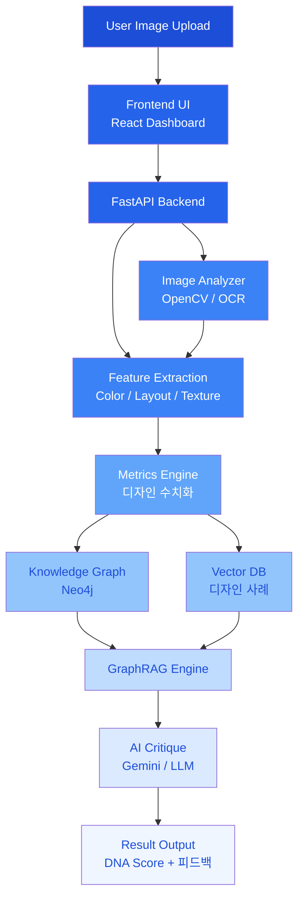

# 🌙 Mood-DNA Ver 2.0


> **Design Intelligence for Designers**  
> 감각을 데이터로, 아이디어를 구조로.

> 🔒 **이 버전은 안정 버전으로 프리즈된 상태입니다.**  
> 신규 개발은 [Mood-DNA v3](https://github.com/hoilycat/Mood-DNA-V3)에서 진행됩니다.


---

🖋️ **Introduction**  
Mood-DNA는 디자이너를 위한 **AI 디자인 파트너**입니다. 단순한 이미지 분석을 넘어, 시각적 지표(Metrics)와 디자인 이론(Knowledge Graph)을 결합하여 디자인 의사결정을 빠르고 정교하게 만들어주는 하이브리드 지능형 도구입니다.

디자인은 감각의 영역이지만, Mood-DNA는 그 감각을 **수치화된 데이터와 학술적 근거**로 번역하여 디자이너의 설득력을 극대화합니다.

---
<br><br><br><br>
## 🎯 Core Features

### 🔍 1. Multi-Dimensional DNA Scanning
OpenCV와 EasyOCR을 활용하여 이미지의 유전자를 정밀 해독합니다.
*   **Visual Metrics:** 밝기, 복잡도, 시각적 집중도(Saliency), 대칭성, 여백 비율, 대비, 구도 안정성 분석.
*   **Form & Texture:** 곡률(Roundness), 직선성(Straightness), 매끄러움(Smoothness) 분석을 통한 형태적 특징 추출.
*   **Color DNA:** K-Means 알고리즘 기반 주요 컬러 팔레트 및 색채 조화도 산출.
<br><br>
### 🧠 2. Hybrid GraphRAG Critique (New!)
디자인 이론과 실무 데이터를 결합한 **지식 그래프 기반 비평 엔진**입니다.
*   **Knowledge Graph:** 디자인 원칙(게슈탈트, 힉의 법칙 등)과 스타일 간의 관계망 구축.
*   **Hybrid Retrieval:** 벡터 검색의 '감성적 맥락'과 그래프 검색의 '논리적 인과관계'를 결합하여 전문적인 디자인 멘토링 제공.
*   **Evidence-based Advice:** 단순히 수치를 나열하는 것이 아니라, 지식 베이스에 근거하여 해당 디자인이 특정 업종이나 타겟에 적합한지 논리적으로 비평합니다.
<br><br>
### 🏆 3. Design Audition (Batch Analysis)
여러 개의 시안 중 브랜드 목표 DNA에 가장 부합하는 'Winner'를 선정합니다.
*   **DNA Matching:** 설정한 Target DNA와 실제 데이터 사이의 유사도를 계산하여 순위 산정.
*   **Master's Report:** AI가 오디션 심사위원처럼 각 시안의 장단점을 비교 분석하여 마스터 리포트를 생성합니다.
<br><br>
### 🖼️ 4. Style Benchmarking
AI 피드백과 연동된 실무 레퍼런스 제안.
*   **SerpApi Integration:** 분석 결과와 매칭되는 최적의 디자인 레퍼런스를 Pinterest, Dribbble, Behance 등에서 실시간으로 큐레이션합니다.

---
<br><br><br><br>
## 🚀 Getting Started

### Prerequisites

| Tool | Version |
|------|---------|
| Node.js | 18+ |
| Python | 3.10+ |
| npm | 9+ |

### 1. Clone & Install

```bash
git clone https://github.com/hoilycat/Mood-DNA-V2.git
cd Mood-DNA-V2

pip install -r requirements.txt
cd frontend && npm install && cd ..
```

### 2. 환경변수 설정

루트에 `.env` 파일을 만들고 필요한 API 키를 입력합니다.

| 변수명 | 필수 여부 | 설명 |
|--------|-----------|------|
| `GEMINI_API_KEY` | 필수 | Gemini AI 분석 엔진 |
| `SERP_API_KEY` | 필수 | 레퍼런스 이미지 검색 |
| `GROQ_API_KEY` | 선택 | AI 분석 폴백 모델 |
| `UNSPLASH_ACCESS_KEY` | 선택 | 추가 이미지 소스 |

### 3. 실행

```bash
npm run dev
```

브라우저에서 `http://localhost:5173`에 접속합니다.

---
<br><br><br><br>
## 🎬 How It Works

Mood-DNA는 디자인 목표를 설정한 뒤 이미지를 업로드해 DNA 점수와 AI 피드백을 확인하는 흐름으로 동작합니다.

```text
Step 1 | 업종 선택
Step 2 | 분위기 태그 선택
Step 3 | Target DNA 확인 및 조정
Step 4 | 이미지 업로드 후 단일 분석 / 비교 분석 / 배치 오디션 실행
```

---
<br><br><br><br>
## ⚙️ System Architecture



---
<br><br><br><br>
## 🧩 Tech Stack

### Frontend
*   **Framework:** React, TypeScript, Vite
*   **Styling:** Tailwind CSS, Shadcn UI
*   **Data Viz:** Recharts (Radar Chart 기반 DNA 시각화)
*   **Animation:** Framer Motion
<br><br>
### Backend
*   **Framework:** Python (FastAPI)
*   **Analysis:** OpenCV, NumPy, EasyOCR, Rembg
*   **Database:** SQLAlchemy (SQLite), Neo4j (Knowledge Graph)
*   **RAG Framework:** **LlamaIndex (Graph Store & Vector Store)**
<br><br>
### AI Models
*   **Primary:** Google Gemini
*   **Fallback:** Groq (Llama 3.3)
*   **Local Fallback:** Ollama (Exaone 3.5, llama3.2-vision)

---
<br><br><br><br>
## 📁 Project Structure
```bash
Mood-DNA-V2/
├── frontend/             # React + Vite 기반의 시각 분석 UI
│   └── src/              # DNA 대시보드 및 위저드 컴포넌트
├── backend/              # FastAPI 기반 고성능 분석 엔진
│   └── app/
│       ├── services/     # 핵심 로직 (Analyzer, GraphRAG, AI Consultant)
│       └── models.py     # 디자인 히스토리 DB 스키마
└── design_wisdom/        # GraphRAG 구축을 위한 디자인 지식 소스 (.txt, .pdf)
```

<br><br>

## 🧭 Roadmap

- [x] 이미지 수치 분석 엔진 구축 (OpenCV)

- [x] 실시간 디자인 DNA 시각화 (Radar Chart)

- [ ] LlamaIndex 기반 Hybrid GraphRAG 시스템 통합 👈 Current Focus

- [ ] 디자인 온톨로지(Design Ontology) 엔티티 확장 및 검증

- [ ] Target Insight 기반 업종별 특화 조언 모듈 고도화

- [ ] 디자인 히스토리 스마트 아카이빙 기능
  
<br><br>
## ✨ Philosophy
"디자인의 ‘감성’을 손상시키지 않으면서 AI의 ‘이성’을 더하다."
Mood-DNA는 기술이 디자인을 대체하는 것이 아니라, 디자이너가 자신의 직관을 논리적으로 증명하고 더 높은 차원의 창의성에 집중할 수 있도록 돕는 도구입니다.
<br><br>

## 🌌 Credits
Designed & Developed by 용용

감각적 사고 + 논리적 구조를 사랑하는 디자이너/메이커.
