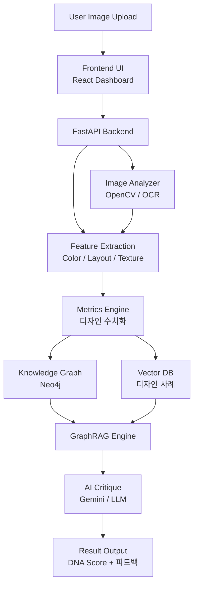

# 🌙 Mood-DNA Ver 2.0
> **Design Intelligence for Designers**  
> 감각을 데이터로, 아이디어를 구조로. 

---
## 🖋️ Introduction

디자인 이미지를 분석해 시각적 요소를 수치화하고,
지식 그래프 기반 AI로 디자인 결정을 논리적 근거와 함께 제시하는 **AI 디자인 분석 도구**입니다.

단순한 이미지 분석을 넘어, 감각적 판단을 **수치 데이터와 디자인 이론**으로 번역해
디자이너의 설득력을 높여줍니다.

---

## ✨ Philosophy

> "디자인의 ‘감성’을 손상시키지 않으면서 AI의 ‘이성’을 더하다."

Mood-DNA는 기술이 디자인을 대체하는 것이 아니라, 디자이너가 자신의 직관을 논리적으로 증명하고 더 높은 차원의 창의성에 집중할 수 있도록 돕는 도구입니다.

---

## 🎯 Core Features

### 🔍 1. Multi-Dimensional DNA Scanning
OpenCV와 EasyOCR을 활용하여 이미지의 유전자를 정밀 해독합니다.
*   **Visual Metrics:** 밝기, 복잡도, 시각적 집중도(Saliency), 대칭성, 여백 비율, 대비, 구도 안정성 분석.
*   **Form & Texture:** 곡률(Roundness), 직선성(Straightness), 매끄러움(Smoothness) 분석을 통한 형태적 특징 추출.
*   **Color DNA:** K-Means 알고리즘 기반 주요 컬러 팔레트 및 색채 조화도 산출.

### 🧠 2. Hybrid GraphRAG Critique (New!)

기존에는 하드코딩된 수치 기준으로 디자인을 평가했다면,
이제는 **왜 그 수치인지**를 디자인 이론으로 설명해줍니다.

- **Knowledge Graph:** 디자인 원칙과 스타일 간의 관계망을 구축해 수치의 근거를 추적
- **Agentic AI:** DB에 없는 정보는 논문·웹 검색으로 실시간 보완
- **확장 가능한 구조:** 어떤 앱에서도 재사용 가능한 에이전트 설계

### 🏆 3. Design Audition (Batch Analysis)
여러 개의 시안 중 브랜드 목표 DNA에 가장 부합하는 'Winner'를 선정합니다.
*   **DNA Matching:** 설정한 Target DNA와 실제 데이터 사이의 유사도를 계산하여 순위 산정.
*   **Master's Report:** AI가 오디션 심사위원처럼 각 시안의 장단점을 비교 분석하여 마스터 리포트를 생성합니다.

### 🖼️ 4. Style Benchmarking
AI 피드백과 연동된 실무 레퍼런스 제안.
*   **SerpApi Integration:** 분석 결과와 매칭되는 최적의 디자인 레퍼런스를 Pinterest, Dribbble, Behance 등에서 실시간으로 큐레이션합니다.

---
## ⚙️ System Architecture



---

## 🧩 Tech Stack

### Frontend
*   **Framework:** React (Vite), TypeScript
*   **Styling:** Tailwind CSS, Shadcn UI
*   **Data Viz:** Recharts (Radar Chart 기반 DNA 시각화)

### Backend
*   **Framework:** Python (FastAPI)
*   **Analysis:** OpenCV, NumPy, EasyOCR, Rembg
*   **Database:** SQLAlchemy (SQLite), **Neo4j (Knowledge Graph)**
*   **RAG Framework:** **LlamaIndex (Graph Store & Vector Store)**

### AI Models
*   **Main Engine:** Google Gemini 1.5 Pro / Flash
*   **Backup/Local:** Groq (Llama 3.3), Ollama (Exaone 3.5, llama3.2-vision)

---

## 📁 Project Structure
```bash
Mood-DNA-V2/
├── frontend/             # React + Vite 기반의 시각 분석 UI
│   └── src/              # DNA 대시보드 및 위저드 컴포넌트
├── backend/              # FastAPI 기반 고성능 분석 엔진
│   └── app/
│       ├── services/     # 핵심 로직 (Analyzer, GraphRAG, AI Consultant)
│       └── models.py     # 디자인 히스토리 DB 스키마
└── design_wisdom/        # GraphRAG 구축을 위한 디자인 지식 소스 (.txt, .pdf)
```

---

## 🧭 Roadmap

- [x] 이미지 수치 분석 엔진 구축 (OpenCV)

- [x] 실시간 디자인 DNA 시각화 (Radar Chart)

- [ ] LlamaIndex 기반 Hybrid GraphRAG 시스템 통합 👈 Current Focus

- [ ] 디자인 온톨로지(Design Ontology) 엔티티 확장 및 검증

- [ ] Target Insight 기반 업종별 특화 조언 모듈 고도화

- [ ] 디자인 히스토리 스마트 아카이빙 기능

---

## 🌌 Credits
Designed & Developed by 용용

감각적 사고 + 논리적 구조를 사랑하는 디자이너/메이커.
